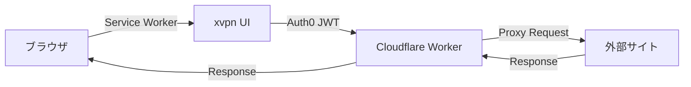

# xvpn

**ブラウザで動作するセキュアなプロキシサービス**

xvpnは、Cloudflare WorkersとAuth0を使用したブラウザベースのHTTP/HTTPSプロキシサービスです。Service Workerを使用してブラウザ内のリクエストをインターセプトし、Cloudflare Workers経由でプロキシします。



## 特徴

- 🔐 **Auth0認証**: GitHubログインまたはメール認証
- ⚡ **Cloudflare Workers**: エッジで高速なプロキシ処理
- 🎨 **モダンUI**: React + Vite + Material Icons
- 🛡️ **セキュリティ**: JWT検証、レートリミット、監査ログ
- 📱 **ブラウザネイティブ**: Service Workerでシームレスなプロキシ

## クイックスタート

### 必要要件

- Node.js 18+
- npm または pnpm
- Cloudflareアカウント
- Auth0アカウント

### 1. リポジトリのクローン

```bash
git clone https://github.com/your-org/xvpn.git
cd xvpn
```

### 2. 依存関係のインストール

```bash
# ルートディレクトリ
npm install

# Worker
cd worker
npm install
cd ..

# Frontend
cd frontend
npm install
cd ..
```

### 3. 環境変数の設定

```bash
# ルートの.envファイルを作成
cp .env.example .env

# worker/.dev.varsファイルを作成
cp worker/.dev.vars.example worker/.dev.vars

# frontend/.envファイルを作成
cp frontend/.env.example frontend/.env
```

各ファイルを編集して、Auth0とCloudflareの認証情報を設定します。
詳細は [docs/setup.md](docs/setup.md) を参照してください。

### 4. ローカル開発

```bash
# Workerを起動（ターミナル1）
cd worker
npm run dev

# Frontendを起動（ターミナル2）
cd frontend
npm run dev
```

ブラウザで `http://localhost:5173` にアクセスします。

## デプロイ

### Cloudflare Workerのデプロイ

```bash
cd worker
npm run deploy
```

### Frontendのデプロイ

Cloudflare Pagesまたは他のホスティングサービスにデプロイ：

```bash
cd frontend
npm run build
# distディレクトリをホスティングサービスにアップロード
```

詳細は [docs/setup.md](docs/setup.md) のデプロイセクションを参照してください。

## ドキュメント

- [セットアップガイド](docs/setup.md) - Auth0とCloudflareの詳細な設定手順
- [アーキテクチャ](docs/architecture.md) - システム設計とデータフロー
- [API仕様](docs/api.md) - OpenAPI仕様と使用例
- [セキュリティ](docs/security.md) - セキュリティ設計と対策
- [制限事項](docs/limitations.md) - ブラウザVPNの技術的制限
- [FAQ](docs/faq.md) - よくある質問
- [トラブルシューティング](docs/troubleshooting.md) - 問題解決ガイド

## プロジェクト構造

```
xvpn/
├── worker/              # Cloudflare Worker (バックエンド)
│   ├── src/
│   │   └── index.js     # メインWorkerコード
│   ├── package.json
│   └── wrangler.toml    # Worker設定
├── frontend/            # React SPA (フロントエンド)
│   ├── src/
│   │   ├── App.jsx      # メインアプリ
│   │   └── main.jsx
│   ├── public/
│   │   └── service-worker.js  # プロキシ用Service Worker
│   ├── package.json
│   └── vite.config.js
├── docs/                # ドキュメント
├── .github/workflows/   # CI/CD
├── openapi.yaml         # API仕様
└── README.md
```

## セキュリティに関する注意

⚠️ **重要な法的・倫理的注意事項**

このプロジェクトは教育目的で提供されています：

1. **法規制の遵守**: プロキシサービスは国や地域によって規制されている場合があります
2. **利用規約の確認**: Cloudflareの利用規約を必ず確認してください
3. **責任ある使用**: 不正アクセスや違法行為に使用しないでください
4. **プライバシー**: ユーザーデータの取り扱いに注意してください
5. **オープンプロキシ対策**: 認証なしで誰でも使える状態にしないでください

詳細は [docs/security.md](docs/security.md) を参照してください。

## 技術スタック

- **フロントエンド**: React 18, Vite 5, Material Icons
- **バックエンド**: Cloudflare Workers
- **認証**: Auth0 (GitHub + Email)
- **プロキシ**: Service Worker + Fetch API
- **CI/CD**: GitHub Actions
- **API仕様**: OpenAPI 3.0

## ライセンス

MIT License - 詳細は [LICENSE](LICENSE) を参照

## 貢献

プルリクエストを歓迎します。大きな変更の場合は、まずissueを開いて変更内容を議論してください。

## サポート

問題が発生した場合：

1. [トラブルシューティング](docs/troubleshooting.md) を確認
2. [FAQ](docs/faq.md) を確認
3. GitHubのissueを作成

---

**注意**: このプロジェクトは実験的なものであり、本番環境での使用には追加のセキュリティ対策と法的確認が必要です。
