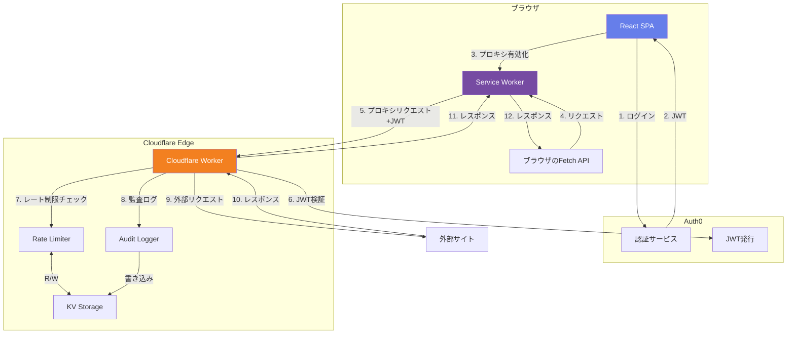
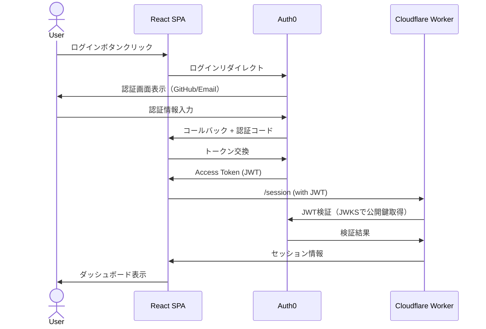
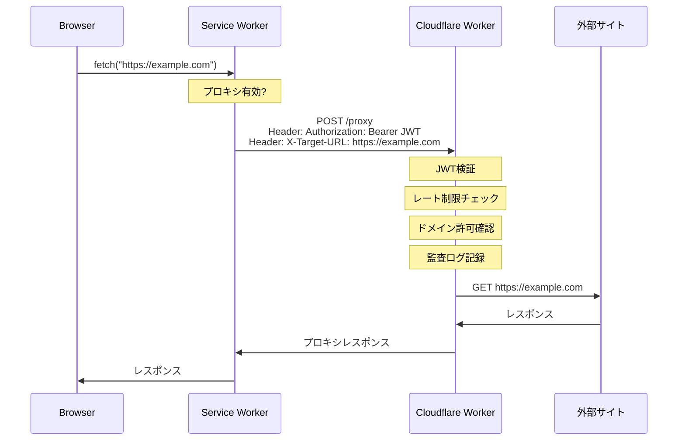

# xvpn アーキテクチャドキュメント

このドキュメントでは、xvpnのシステム設計、データフロー、各コンポーネントの詳細を説明します。

## 目次

1. [システム概要](#システム概要)
2. [アーキテクチャ図](#アーキテクチャ図)
3. [コンポーネント詳細](#コンポーネント詳細)
4. [データフロー](#データフロー)
5. [プロキシ方式の選択理由](#プロキシ方式の選択理由)
6. [技術的決定事項](#技術的決定事項)

## システム概要

xvpnは、ブラウザベースのHTTP/HTTPSプロキシサービスです。以下の3つの主要コンポーネントで構成されています：

1. **フロントエンド (React SPA)**: ユーザーインターフェース
2. **Service Worker**: ブラウザ内でリクエストをインターセプト
3. **Cloudflare Worker**: バックエンドプロキシサーバー

認証にはAuth0を使用し、JWTトークンでWorkerへのアクセスを保護します。

## アーキテクチャ図

### 全体アーキテクチャ



### 認証フロー



### プロキシリクエストフロー



## コンポーネント詳細

### 1. React SPA (フロントエンド)

**技術スタック**:
- React 18
- Vite 5（ビルドツール）
- Auth0 React SDK
- Material Icons

**主な機能**:
- Auth0認証フロー
- プロキシの有効化/無効化
- セッション情報表示
- プロキシテスト機能

**ファイル構成**:
```
frontend/
├── src/
│   ├── main.jsx          # エントリーポイント、Auth0Provider設定
│   ├── App.jsx           # メインアプリケーション
│   ├── App.css           # スタイル
│   └── index.css         # グローバルスタイル
├── public/
│   └── service-worker.js # プロキシ用Service Worker
├── index.html            # HTMLテンプレート
└── vite.config.js        # Vite設定
```

**状態管理**:
- `useAuth0`フック: 認証状態、ユーザー情報、トークン取得
- ローカルstate: プロキシ有効状態、エラー、セッション情報

### 2. Service Worker

**役割**:
ブラウザ内でHTTP/HTTPSリクエストをインターセプトし、Cloudflare Worker経由でプロキシします。

**動作原理**:
1. SPAから`ENABLE_PROXY`メッセージを受信
2. Worker URLとJWTトークンを保存
3. `fetch`イベントをリッスン
4. 条件に合致するリクエストをインターセプト
5. Cloudflare Workerの`/proxy`エンドポイントに転送
6. レスポンスをブラウザに返却

**インターセプト条件**:
- プロキシが有効
- HTTP/HTTPSプロトコル
- 自身のオリジン以外
- Worker URL以外
- ブラウザ拡張ではない

**制限事項**:
- 同一オリジンポリシー（CORS）の制約あり
- 混合コンテンツ（HTTPSページからHTTP）は制限される
- WebSocket、Server-Sent Eventsは未対応

### 3. Cloudflare Worker (バックエンド)

**技術スタック**:
- Cloudflare Workers Runtime (V8 isolate)
- Node.js互換モード
- jose: JWT検証ライブラリ
- KV Storage: データ永続化

**主要エンドポイント**:

| エンドポイント | メソッド | 説明 | 認証 |
|--------------|---------|------|-----|
| `/health` | GET | ヘルスチェック | 不要 |
| `/api` | GET | API情報 | 不要 |
| `/session` | GET | セッション情報取得 | 必要 |
| `/proxy` | GET/POST | プロキシリクエスト | 必要 |

**JWT検証プロセス**:
1. `Authorization`ヘッダーからトークン抽出
2. Auth0のJWKS（JSON Web Key Set）を取得
3. トークンの署名を検証
4. issuer、audience、有効期限をチェック
5. ユーザーID（sub claim）を抽出

**レート制限**:
- KV Storageにカウンターを保存
- ユーザーごとにウィンドウ（デフォルト60秒）内のリクエスト数を制限
- デフォルト: 100リクエスト/分

**アルゴリズム**:
```javascript
key = "ratelimit:{userId}"
current = KV.get(key)

if (!current || now > current.resetAt) {
  // 新しいウィンドウ
  KV.put(key, { count: 1, resetAt: now + windowMs })
  return { allowed: true }
}

if (current.count >= maxRequests) {
  return { allowed: false, resetAt: current.resetAt }
}

// カウント増加
current.count++
KV.put(key, current)
return { allowed: true }
```

**監査ログ**:
全てのプロキシリクエストをKVに記録：
```javascript
{
  type: 'proxy_request' | 'proxy_blocked' | 'proxy_error',
  userId: 'auth0|123',
  targetUrl: 'https://example.com',
  timestamp: '2025-01-01T00:00:00Z',
  ...
}
```

保持期間: 30日

**プロキシ処理**:
1. `X-Target-URL`ヘッダーからターゲットURLを取得
2. URLの妥当性を検証
3. 許可ドメインリストをチェック
4. 外部サイトへリクエスト送信
5. レスポンスを返却

### 4. KV Storage

Cloudflare Workers KVを3つの用途で使用：

| Namespace | 用途 | TTL |
|-----------|------|-----|
| RATE_LIMIT | レート制限カウンター | 動的（ウィンドウ期間） |
| SESSIONS | セッション情報（将来拡張用） | 24時間 |
| AUDIT_LOG | 監査ログ | 30日 |

**特性**:
- Eventually consistent（結果整合性）
- 読み取り: 低レイテンシ（エッジキャッシュ）
- 書き込み: 数秒の遅延あり
- 無料枠: 100,000 read/day, 1,000 write/day

### 5. Auth0

**役割**:
- ユーザー認証
- JWT発行
- ソーシャルログイン（GitHub）
- メールログイン（Passwordless/Database）

**設定項目**:
- **Application**: SPA設定、コールバックURL
- **API**: Audience（JWT検証用）
- **Connections**: GitHub、Email
- **Rules/Actions**: カスタムロジック（必要に応じて）

## データフロー

### 初回ログイン時

1. ユーザーがSPAにアクセス
2. 未認証のため、ログイン画面表示
3. 「ログイン」ボタン → Auth0へリダイレクト
4. GitHub/メールで認証
5. Auth0からコールバックURL（SPA）へリダイレクト
6. SPAがAuth0から Access Token (JWT) を取得
7. SPAがWorkerの`/session`にリクエスト（JWT付き）
8. Workerが JWT を検証
9. セッション情報を返却
10. ダッシュボード表示

### プロキシ有効化時

1. ユーザーが「プロキシを有効化」ボタンをクリック
2. SPAがJWTを取得
3. Service Workerに`ENABLE_PROXY`メッセージ送信
   - Worker URL
   - JWT
4. Service WorkerがFetchイベントリスナーを有効化
5. ユーザーに「有効」と表示

### プロキシリクエスト時

1. ブラウザが`fetch("https://example.com")`を実行
2. Service Workerがインターセプト
3. 条件チェック（プロキシ有効、HTTP/HTTPS、外部ドメイン）
4. Worker の `/proxy` に POST リクエスト
   - `Authorization: Bearer {JWT}`
   - `X-Target-URL: https://example.com`
5. Worker が JWT 検証
6. レート制限チェック
7. ドメイン許可チェック
8. 監査ログ記録
9. 外部サイトへリクエスト
10. レスポンス取得
11. Service Workerへレスポンス返却
12. ブラウザへレスポンス返却

## プロキシ方式の選択理由

### 検討した方式

#### 方式A: Service Worker + Fetch プロキシ（採用）

**概要**: Service Workerがブラウザのfetchをインターセプトし、Cloudflare Worker経由でプロキシ。

**利点**:
- ブラウザ標準機能のみ（拡張不要）
- 実装がシンプル
- HTTPS通信で安全
- Cloudflare Workersの高速性を活用

**欠点**:
- 各リクエストにオーバーヘッド（2ホップ）
- CORSの制約あり
- WebSocket、SSE未対応
- 混合コンテンツの制限

**採用理由**:
- **ブラウザネイティブ**: 拡張機能不要で動作
- **セキュリティ**: HTTPSで通信
- **実現可能性**: 技術的に実証済み
- **メンテナンス性**: シンプルな構成

#### 方式B: WebSocket/WebTransport トンネル

**概要**: WebSocketまたはWebTransportで双方向トンネルを確立。

**利点**:
- リアルタイム双方向通信
- 長時間接続維持
- より「VPN」に近い動作

**欠点**:
- 実装が複雑
- WebTransportはブラウザサポートが限定的
- Cloudflare WorkersのWebSocket制限（Durable Objects必要）
- 接続維持のコストが高い
- デバッグが困難

**不採用理由**: 複雑性に対してメリットが小さい

#### 方式C: Cloudflare Tunnels/Argo

**概要**: Cloudflare Tunnelsを使用してトラフィックをルーティング。

**利点**:
- Cloudflareのネイティブ機能
- 高性能

**欠点**:
- ブラウザ単体では不可（別途エージェント必要）
- 有料プラン必要
- セットアップが複雑

**不採用理由**: ブラウザベースという要件に合わない

### 代替案の比較表

| 項目 | 方式A (採用) | 方式B | 方式C |
|------|-------------|-------|-------|
| ブラウザのみで動作 | ✅ | ✅ | ❌ |
| 実装の複雑さ | 低 | 高 | 中 |
| パフォーマンス | 中 | 高 | 高 |
| WebSocket対応 | ❌ | ✅ | ✅ |
| コスト | 低 | 中 | 高 |
| メンテナンス性 | 高 | 低 | 中 |

## 技術的決定事項

### なぜReact?

- **人気**: 大きなコミュニティとエコシステム
- **Auth0 SDK**: 公式Reactライブラリが充実
- **Service Worker統合**: 既存パターンが豊富
- **開発効率**: Viteで高速な開発体験

### なぜVite?

- **高速**: ESビルドで超高速
- **シンプル**: 設定が最小限
- **Modern**: ESM ネイティブ
- **HMR**: 高速なホットリロード

### なぜCloudflare Workers?

- **エッジコンピューティング**: 世界中のエッジで実行
- **高速起動**: V8 isolateで即座に起動
- **スケーラビリティ**: 自動スケール
- **無料枠**: 開発に十分
- **統合**: KV、Durable Objectsと統合

### なぜAuth0?

- **簡単**: セットアップが容易
- **セキュア**: 業界標準のセキュリティ
- **ソーシャルログイン**: GitHub等を簡単に統合
- **JWT**: 標準的なトークン形式
- **無料枠**: 小規模利用に十分

### なぜKV Storage?

- **シンプル**: Key-Valueで使いやすい
- **グローバル**: エッジで利用可能
- **低コスト**: 無料枠あり
- **十分な性能**: レート制限、ログ用途に最適

## セキュリティ考慮事項

詳細は [security.md](./security.md) を参照してください。

主要な対策:
- **認証**: 全てのWorkerエンドポイントでJWT検証
- **レート制限**: DDoS防止
- **ドメイン制限**: オープンプロキシ化防止
- **監査ログ**: 全てのアクションを記録
- **CORS**: 許可されたオリジンのみ
- **HTTPS**: 全通信を暗号化

## 制限事項

詳細は [limitations.md](./limitations.md) を参照してください。

主な制限:
- **WebSocket未対応**: 通常のHTTP/HTTPSのみ
- **CORSの制約**: ブラウザのCORS制限は残る
- **パフォーマンス**: 2ホップのため若干遅延
- **混合コンテンツ**: HTTPS→HTTPは制限される

## 今後の拡張案

1. **WebSocket対応**: Durable Objectsを使用
2. **キャッシング**: よく使うリソースをKVにキャッシュ
3. **分析ダッシュボード**: 使用状況の可視化
4. **管理者機能**: ユーザー管理、ログ閲覧
5. **ブラウザ拡張**: より深いインテグレーション

## 参考資料

- [Cloudflare Workers Documentation](https://developers.cloudflare.com/workers/)
- [Service Worker API](https://developer.mozilla.org/en-US/docs/Web/API/Service_Worker_API)
- [Auth0 Documentation](https://auth0.com/docs)
- [React Documentation](https://react.dev/)
